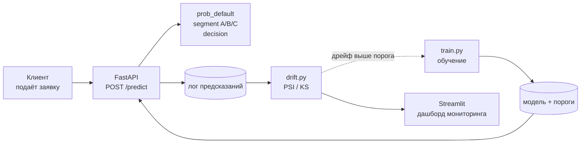

# Кредитный скоринг для МФО

End-to-end система оценки кредитного риска: от обучения модели до REST API и мониторинга деградации после деплоя.

---

## Результаты

| Что | Значение |
|---|---|
| PR-AUC / ROC-AUC / Gini | 0.62 / 0.78 / 0.56 |
| Дефолтность одобряемого портфеля | **29% -> 17%** (сегментация A/B/C) |
| Прибыль портфеля без модели | −3.2 млн ₽ |
| Прибыль при наивном пороге 0.5 | +258 тыс ₽ |
| **Прибыль при оптимальных порогах** | **+1.70 млн ₽** |

Данные: 10 000 заявок, 9 признаков, доля дефолтов 29%.

Ключевой вывод: подбор порога одобрения по прибыли (а не по умолчанию 0.5) даёт **+1.44 млн ₽** на портфеле из 3 000 заявок.

---

## Архитектура



Две двери в систему: **FastAPI** - для бэкенда МФО (решения по заявкам в реальном времени), **Streamlit** - для мониторинга.

---

## Быстрый старт

```bash
docker-compose up --build
```

- API: http://localhost:8000/docs
- Дашборд: http://localhost:8501

Модель обучается при сборке образа

</details>

---

## Структура
```
src/
  data.py              загрузка конфига, данных, воспроизводимый split
  preprocessing.py     заполнение пропусков + инженерные признаки
  pipeline.py          сборка sklearn-пайплайна из конфига
  train.py             обучение, сохранение модели и порогов
  eval.py              метрики на тесте -> metrics.json
  segmentation.py      сегменты риска A/B/C
  drift.py             PSI и KS - детекция дрейфа данных
  simulate.py          симуляция дрейфа (проверка сигнальной системы)
  profit.py          матрица прибыли, экономика решений
  thresholds.py        подбор порогов, максимизирующих прибыль
  shap_analysis.py     интерпретация модели
  api.py               FastAPI: /predict, /health
  prediction_logger.py лог предсказаний (observability)
  dashboard.py         Streamlit - дашборд симуляции дрейфа
config/config.yaml     конфиг
notebooks/             ноутбуки
tests/                 тесты
```

---

## Ключевые решени

**Логистическая регрессия, а не градиентный бустинг.** LightGBM давал незначительно лучшую метрику, но для кредитного скоринга объяснимость важнее: решение должно проходить проверку риск-команды и регулятора, а отказ клиенту должен быть обоснованным. Коэффициенты переводятся в odds ratio, вклад каждого признака в конкретное решение раскладывается через SHAP.

**Пороги решений подобраны по прибыли, а не по умолчанию 0.5.** Дефолт стоит МФО всю сумму займа, хороший клиент приносит ~20% маржи - потери асимметричны 5:1. Поэтому оптимальный порог автоодобрения оказался 0.30, а не 0.5: выгодно отказывать агрессивнее.

**Политика трёх действий с ограничением мощности.** Одобрить / ручная проверка / отказ. Наивный оптимум отправлял на ручную проверку 65% заявок - операционно невозможно, поэтому добавлено ограничение пропускной способности андеррайтинга (15%). Цена этого ограничения -> 1.18 млн ₽, что даёт бизнесу основание для расчёта расширения команды.

**Мониторинг входных данных, а не только качества модели.** PR-AUC требует истинных меток, которые приходят через недели (когда закончится срок займа). PSI считается сразу по входящим заявкам, без меток - поэтому триггер переобучения повешен на дрейф данных, а не на просадку метрики.

---

## Ограничения

Проект честно описывает свои границы:

- **Данные синтетические, без временной оси.** Дрейф моделируется контролируемо (`simulate.py`) - это позволяет проверить, что сигнальная система работает, но не заменяет наблюдение реального дрейфа во времени.
- **Экономические параметры - обоснованные допущения**, а не данные конкретной компании. Вынесены в конфиг, пересчёт сценариев - правка одной строки.
- **Инженерные признаки мультиколлинеарны** (производные от одних величин). L1-регуляризация частично решает это автоматически; формальный анализ VIF подтверждает.
